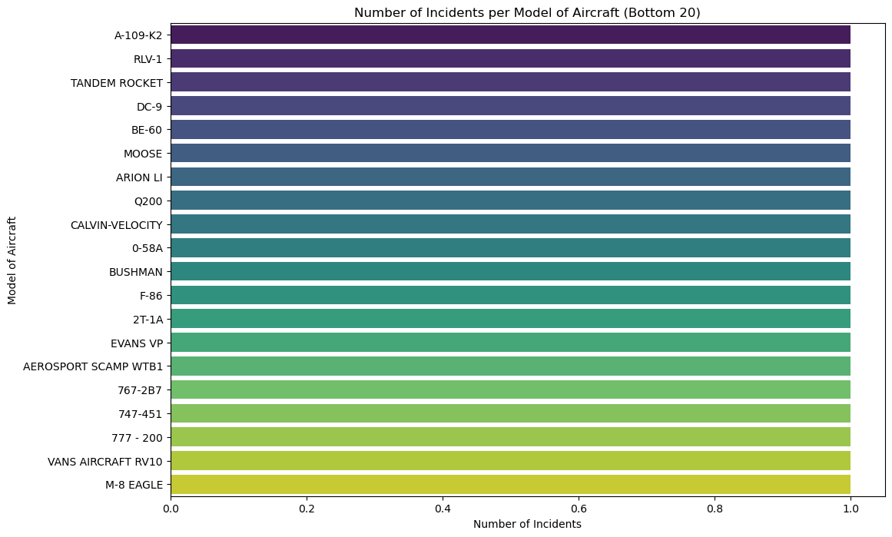
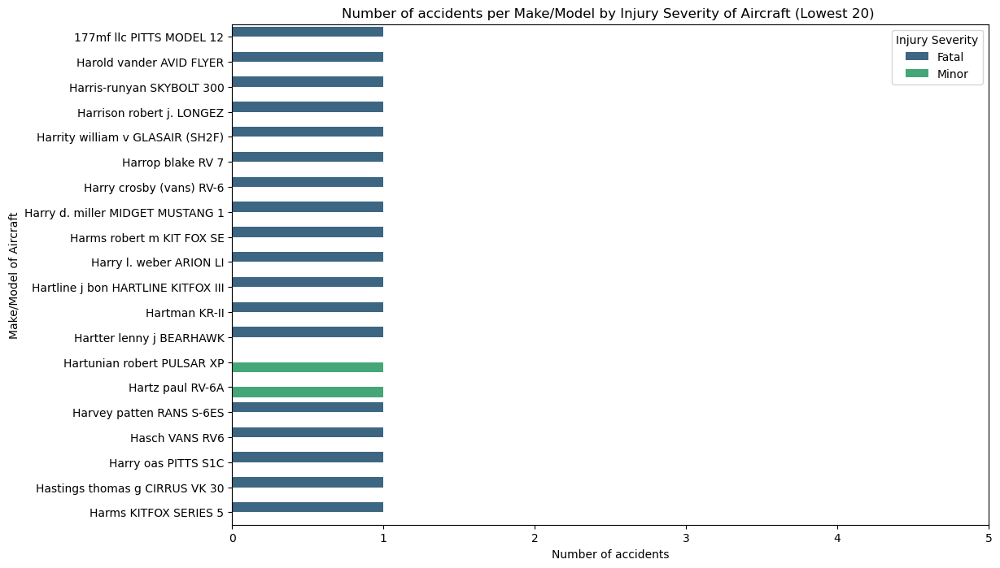

                     Aviation Data Analysis
INTRODUCTION
In this project, we are going to do a detailed analysis on the dataset from the National Transportation Safety Board that includes aviation accident data from 1962 to 2023 about civil aviation accidents and selected incidents in the United States and international waters.

BUSINESS UNDERSTANDING.
What is the relationship between aircraft accidents and aircraft success? Intuitively, we might assume that the frequency of aircraft accidents might cause the success or failure of an aircraft company, while this has been demonstrated to be true for most cases.
 Could you identify the least risky aircraft option?. Afterward, provide actionable insights to the head of the new aviation division to guide their purchasing decisions
 Problem statement :You want to identify the least risky aircraft option

OVERVIEW
For this project, you will use data cleaning, imputation, analysis, and visualization to generate insights and give the neccesary recommendation insights from the analysis process
                     
Data understanding
The data source will be pulled from two separate files.

AviationData.csv
Source: this dataset comes from the National Transportation Safety Board it is a public-domain dataset

USState_code
Source: this dataset comes from the National Transport Safety Board, it is a public-domain dataset
Contents: it entails the names of the US states and their respective codes
Import the neccesaary librabries
import pandas as pd 
import csv
import numpy as np
import matplotlib.pyplot as plt
import seaborn as sns
import requests
from datetime import datetime

%matplotlib inline 

#df = pd.concat(
   # [pd.read_csv(ZipFile('archive.zip').open(i)) for i in ZipFile('archive.zip').namelist()],
   # ignore_index=True

load data into pandas
pd.set_option('display.max_columns', None)
Aviation_Data = pd.read_csv("AviationData.csv", encoding='latin1',low_memory=False)

Aviation_Data.head()

Event.Id	Investigation.Type	Accident.Number	Event.Date	Location	Country	Latitude	Longitude	Airport.Code	Airport.Name	Injury.Severity	Aircraft.damage	Aircraft.Category	Registration.Number	Make	Model	Amateur.Built	Number.of.Engines	Engine.Type	FAR.Description	Schedule	Purpose.of.flight	Air.carrier	Total.Fatal.Injuries	Total.Serious.Injuries	Total.Minor.Injuries	Total.Uninjured	Weather.Condition	Broad.phase.of.flight	Report.Status	Publication.Date
0	20001218X45444	Accident	SEA87LA080	1948-10-24	MOOSE CREEK, ID	United States	NaN	NaN	NaN	NaN	Fatal(2)	Destroyed	NaN	NC6404	Stinson	108-3	No	1.0	Reciprocating	NaN	NaN	Personal	NaN	2.0	0.0	0.0	0.0	UNK	Cruise	Probable Cause	NaN
1	20001218X45447	Accident	LAX94LA336	1962-07-19	BRIDGEPORT, CA	United States	NaN	NaN	NaN	NaN	Fatal(4)	Destroyed	NaN	N5069P	Piper	PA24-180	No	1.0	Reciprocating	NaN	NaN	Personal	NaN	4.0	0.0	0.0	0.0	UNK	Unknown	Probable Cause	19-09-1996
2	20061025X01555	Accident	NYC07LA005	1974-08-30	Saltville, VA	United States	36.922223	-81.878056	NaN	NaN	Fatal(3)	Destroyed	NaN	N5142R	Cessna	172M	No	1.0	Reciprocating	NaN	NaN	Personal	NaN	3.0	NaN	NaN	NaN	IMC	Cruise	Probable Cause	26-02-2007
3	20001218X45448	Accident	LAX96LA321	1977-06-19	EUREKA, CA	United States	NaN	NaN	NaN	NaN	Fatal(2)	Destroyed	NaN	N1168J	Rockwell	112	No	1.0	Reciprocating	NaN	NaN	Personal	NaN	2.0	0.0	0.0	0.0	IMC	Cruise	Probable Cause	12-09-2000
4	20041105X01764	Accident	CHI79FA064	1979-08-02	Canton, OH	United States	NaN	NaN	NaN	NaN	Fatal(1)	Destroyed	NaN	N15NY	Cessna	501	No	NaN	NaN	NaN	NaN	Personal	NaN	1.0	2.0	NaN	0.0	VMC	Approach	Probable Cause	16-04-1980

Event.Id	Investigation.Type	Accident.Number	Event.Date	Location	Country	Latitude	Longitude	Airport.Code	Airport.Name	Injury.Severity	Aircraft.damage	Aircraft.Category	Registration.Number	Make	Model	Amateur.Built	Number.of.Engines	Engine.Type	FAR.Description	Schedule	Purpose.of.flight	Air.carrier	Total.Fatal.Injuries	Total.Serious.Injuries	Total.Minor.Injuries	Total.Uninjured	Weather.Condition	Broad.phase.of.flight	Report.Status	Publication.Date
0	20001218X45444	Accident	SEA87LA080	1948-10-24	MOOSE CREEK, ID	United States	NaN	NaN	NaN	NaN	Fatal(2)	Destroyed	NaN	NC6404	Stinson	108-3	No	1.0	Reciprocating	NaN	NaN	Personal	NaN	2.0	0.0	0.0	0.0	UNK	Cruise	Probable Cause	NaN
1	20001218X45447	Accident	LAX94LA336	1962-07-19	BRIDGEPORT, CA	United States	NaN	NaN	NaN	NaN	Fatal(4)	Destroyed	NaN	N5069P	Piper	PA24-180	No	1.0	Reciprocating	NaN	NaN	Personal	NaN	4.0	0.0	0.0	0.0	UNK	Unknown	Probable Cause	19-09-1996
2	20061025X01555	Accident	NYC07LA005	1974-08-30	Saltville, VA	United States	36.922223	-81.878056	NaN	NaN	Fatal(3)	Destroyed	NaN	N5142R	Cessna	172M	No	1.0	Reciprocating	NaN	NaN	Personal	NaN	3.0	NaN	NaN	NaN	IMC	Cruise	Probable Cause	26-02-2007
3	20001218X45448	Accident	LAX96LA321	1977-06-19	EUREKA, CA	United States	NaN	NaN	NaN	NaN	Fatal(2)	Destroyed	NaN	N1168J	Rockwell	112	No	1.0	Reciprocating	NaN	NaN	Personal	NaN	2.0	0.0	0.0	0.0	IMC	Cruise	Probable Cause	12-09-2000
4	20041105X01764	Accident	CHI79FA064	1979-08-02	Canton, OH	United States	NaN	NaN	NaN	NaN	Fatal(1)	Destroyed	NaN	N15NY	Cessna	501	No	NaN	NaN	NaN	NaN	Personal	NaN	1.0	2.0	NaN	0.0	VMC	Approach	Probable Cause	16-04-1980

Aviation_Data.columns

Index(['Event.Id', 'Investigation.Type', 'Accident.Number', 'Event.Date',
       'Location', 'Country', 'Latitude', 'Longitude', 'Airport.Code',
       'Airport.Name', 'Injury.Severity', 'Aircraft.damage',
       'Aircraft.Category', 'Registration.Number', 'Make', 'Model',
       'Amateur.Built', 'Number.of.Engines', 'Engine.Type', 'FAR.Description',
       'Schedule', 'Purpose.of.flight', 'Air.carrier', 'Total.Fatal.Injuries',
       'Total.Serious.Injuries', 'Total.Minor.Injuries', 'Total.Uninjured',
       'Weather.Condition', 'Broad.phase.of.flight', 'Report.Status',
       'Publication.Date'],
      dtype='object')
      #preliminary Structure
Aviation_Data.info()
<class 'pandas.core.frame.DataFrame'>
RangeIndex: 88889 entries, 0 to 88888
Data columns (total 31 columns):
 #   Column                  Non-Null Count  Dtype  
---  ------                  --------------  -----  
 0   Event.Id                88889 non-null  object 
 1   Investigation.Type      88889 non-null  object 
 2   Accident.Number         88889 non-null  object 
 3   Event.Date              88889 non-null  object 
 4   Location                88837 non-null  object 
 5   Country                 88663 non-null  object 
 6   Latitude                34382 non-null  object 
 7   Longitude               34373 non-null  object 
 8   Airport.Code            50132 non-null  object 
 9   Airport.Name            52704 non-null  object 
 10  Injury.Severity         87889 non-null  object 
 11  Aircraft.damage         85695 non-null  object 
 12  Aircraft.Category       32287 non-null  object 
 13  Registration.Number     87507 non-null  object 
 14  Make                    88826 non-null  object 
 15  Model                   88797 non-null  object 
 16  Amateur.Built           88787 non-null  object 
 17  Number.of.Engines       82805 non-null  float64
 18  Engine.Type             81793 non-null  object 
 19  FAR.Description         32023 non-null  object 
...
 29  Report.Status           82505 non-null  object 
 30  Publication.Date        75118 non-null  object 
dtypes: float64(5), object(26)
memory usage: 21.0+ MB
Output is truncated. View as a scrollable element or open in a text editor. Adjust cell output settings...

Aviation_Data.shape
(88889, 31)

Filter data by aircraft as it is the focus of the business problem

options = ['Airplane','Helicopter','Balloon']
New_Aviation_data = Aviation_Data[Aviation_Data['Aircraft.Category'].isin(options)]

missing_values = New_Aviation_data.isnull().sum()
print(missing_values)

Event.Id                      0
Investigation.Type            0
Accident.Number               0
Event.Date                    0
Location                      9
Country                      12
Latitude                   6234
Longitude                  6244
Airport.Code              12422
Airport.Name              11838
Injury.Severity             879
Aircraft.damage            1449
Aircraft.Category             0
Registration.Number         281
Make                         12
Model                        33
Amateur.Built                19
Number.of.Engines          3347
Engine.Type                5113
FAR.Description             596
Schedule                  27812
Purpose.of.flight          4418
Air.carrier               18010
Total.Fatal.Injuries       3592
Total.Serious.Injuries     3621
...
Broad.phase.of.flight     24100
Report.Status              5850
Publication.Date           1171
dtype: int64
Output is truncated. View as a scrollable element or open in a text editor. Adjust cell output settings...

# Descreptive Analysis on Numeric features
New_Aviation_data.describe()

Number.of.Engines	Total.Fatal.Injuries	Total.Serious.Injuries	Total.Minor.Injuries	Total.Uninjured
count	27941.000000	27696.000000	27667.000000	28049.000000	30251.000000
mean	1.145199	0.644497	0.306791	0.262505	5.779181
std	0.410053	5.604127	1.994570	2.731053	29.982850
min	0.000000	0.000000	0.000000	0.000000	0.000000
25%	1.000000	0.000000	0.000000	0.000000	0.000000
50%	1.000000	0.000000	0.000000	0.000000	1.000000
75%	1.000000	0.000000	0.000000	0.000000	2.000000
max	8.000000	295.000000	161.000000	380.000000	588.000000

# Descreptive analysis on Categorical features
New_Aviation_data.describe(include=['O'])

Event.Id	Investigation.Type	Accident.Number	Event.Date	Location	Country	Latitude	Longitude	Airport.Code	Airport.Name	Injury.Severity	Aircraft.damage	Aircraft.Category	Registration.Number	Make	Model	Amateur.Built	Engine.Type	FAR.Description	Schedule	Purpose.of.flight	Air.carrier	Weather.Condition	Broad.phase.of.flight	Report.Status	Publication.Date
count	31288	31288	31288	31288	31279	31276	25054	25044	18866	19450	30409	29839	31288	31007	31276	31255	31269	26175	30692	3476	26870	13278	27666	7188	25438	30117
unique	31187	2	31264	7552	14749	176	19188	20311	6645	11970	39	4	3	29789	4240	6115	2	10	29	3	26	11241	4	12	16390	1245
top	20220918105957	Accident	ERA22LA379	1982-05-16	Anchorage, AK	United States	332739N	0112457W	PVT	Private	Non-Fatal	Substantial	Airplane	UNREG	CESSNA	172	No	Reciprocating	091	NSCH	Personal	Pilot	VMC	Landing	Probable Cause	25-09-2020
freq	2	29540	2	24	103	27181	19	24	310	183	23777	24514	27617	74	4867	870	27941	22113	17407	1631	16952	244	25705	2443	7189	16359

New_Aviation_data.dtypes

Event.Id                   object
Investigation.Type         object
Accident.Number            object
Event.Date                 object
Location                   object
Country                    object
Latitude                   object
Longitude                  object
Airport.Code               object
Airport.Name               object
Injury.Severity            object
Aircraft.damage            object
Aircraft.Category          object
Registration.Number        object
Make                       object
Model                      object
Amateur.Built              object
Number.of.Engines         float64
Engine.Type                object
FAR.Description            object
Schedule                   object
Purpose.of.flight          object
Air.carrier                object
Total.Fatal.Injuries      float64
Total.Serious.Injuries    float64
...
Weather.Condition          object
Broad.phase.of.flight      object
Report.Status              object
Publication.Date           object
dtype: object
Output is truncated. View as a scrollable element or open in a text editor. Adjust cell output settings...

Drop columns that are not related to the business problem

New_Aviation_data = New_Aviation_data.drop(columns=['Investigation.Type', 'Country', 'Latitude', 'Longitude', 'Airport.Code', 'Airport.Name', 'Registration.Number', 'FAR.Description', 'Purpose.of.flight', 'Report.Status'])

Convert the 'Event.Date' column to datetime format
 New_Aviation_data.loc[:, 'Event.Date'] = pd.to_datetime(New_Aviation_data['Event.Date'])
  New_Aviation_data.head()
   
   
Event.Id	Accident.Number	Event.Date	Location	Injury.Severity	Aircraft.damage	Aircraft.Category	Make	Model	Amateur.Built	Number.of.Engines	Engine.Type	Schedule	Air.carrier	Total.Fatal.Injuries	Total.Serious.Injuries	Total.Minor.Injuries	Total.Uninjured	Weather.Condition	Broad.phase.of.flight	Publication.Date
5	20170710X52551	NYC79AA106	1979-09-17 00:00:00	BOSTON, MA	Non-Fatal	Substantial	Airplane	Mcdonnell Douglas	DC9	No	2.0	Turbo Fan	SCHD	Air Canada	NaN	NaN	1.0	44.0	VMC	Climb	19-09-2017
7	20020909X01562	SEA82DA022	1982-01-01 00:00:00	PULLMAN, WA	Non-Fatal	Substantial	Airplane	Cessna	140	No	1.0	Reciprocating	NaN	NaN	0.0	0.0	0.0	2.0	VMC	Takeoff	01-01-1982
8	20020909X01561	NYC82DA015	1982-01-01 00:00:00	EAST HANOVER, NJ	Non-Fatal	Substantial	Airplane	Cessna	401B	No	2.0	Reciprocating	NaN	NaN	0.0	0.0	0.0	2.0	IMC	Landing	01-01-1982
12	20020917X02148	FTW82FRJ07	1982-01-02 00:00:00	HOMER, LA	Non-Fatal	Destroyed	Airplane	Bellanca	17-30A	No	1.0	Reciprocating	NaN	NaN	0.0	0.0	1.0	0.0	IMC	Cruise	02-01-1983
13	20020917X02134	FTW82FRA14	1982-01-02 00:00:00	HEARNE, TX	Fatal(1)	Destroyed	Airplane	Cessna	R172K	No	1.0	Reciprocating	NaN	NaN	1.0	0.0	0.0	0.0	IMC	Takeoff	02-01-1983

New_Aviation_data.info
 
 <bound method DataFrame.info of              Event.Id Accident.Number           Event.Date          Location  \
5      20170710X52551      NYC79AA106  1979-09-17 00:00:00        BOSTON, MA   
7      20020909X01562      SEA82DA022  1982-01-01 00:00:00       PULLMAN, WA   
8      20020909X01561      NYC82DA015  1982-01-01 00:00:00  EAST HANOVER, NJ   
12     20020917X02148      FTW82FRJ07  1982-01-02 00:00:00         HOMER, LA   
13     20020917X02134      FTW82FRA14  1982-01-02 00:00:00        HEARNE, TX   
...               ...             ...                  ...               ...   
88869  20221213106455      WPR23LA065  2022-12-13 00:00:00     Lewistown, MT   
88873  20221215106463      ERA23LA090  2022-12-14 00:00:00      San Juan, PR   
88876  20221219106475      WPR23LA069  2022-12-15 00:00:00       Wichita, KS   
88877  20221219106470      ERA23LA091  2022-12-16 00:00:00   Brooksville, FL   
88886  20221227106497      WPR23LA075  2022-12-26 00:00:00        Payson, AZ   

      Injury.Severity Aircraft.damage Aircraft.Category  \
5           Non-Fatal     Substantial          Airplane   
7           Non-Fatal     Substantial          Airplane   
8           Non-Fatal     Substantial          Airplane   
12          Non-Fatal       Destroyed          Airplane   
13           Fatal(1)       Destroyed          Airplane   
...               ...             ...               ...   
88869       Non-Fatal     Substantial          Airplane   
88873       Non-Fatal     Substantial          Airplane   
88876       Non-Fatal     Substantial          Airplane   
88877           Minor     Substantial          Airplane   
88886       Non-Fatal     Substantial          Airplane   
...
88876       19-12-2022  
88877       23-12-2022  
88886       27-12-2022  

[31288 rows x 21 columns]>
Output is truncated. View as a scrollable element or open in a text editor. Adjust cell output settings...
 
 # Descreptive Analysis on Numeric features
New_Aviation_data.describe()

Number.of.Engines	Total.Fatal.Injuries	Total.Serious.Injuries	Total.Minor.Injuries	Total.Uninjured
count	27941.000000	27696.000000	27667.000000	28049.000000	30251.000000
mean	1.145199	0.644497	0.306791	0.262505	5.779181
std	0.410053	5.604127	1.994570	2.731053	29.982850
min	0.000000	0.000000	0.000000	0.000000	0.000000
25%	1.000000	0.000000	0.000000	0.000000	0.000000
50%	1.000000	0.000000	0.000000	0.000000	1.000000
75%	1.000000	0.000000	0.000000	0.000000	2.000000
max	8.000000	295.000000	161.000000	380.000000	588.000000

# Descreptive analysis on Categorical features
New_Aviation_data.describe(include=['O'])
C:\Users\user\AppData\Local\Temp\ipykernel_34732\4195627524.py:2: FutureWarning: The behavior of value_counts with object-dtype is deprecated. In a future version, this will *not* perform dtype inference on the resulting index. To retain the old behavior, use `result.index = result.index.infer_objects()`
  New_Aviation_data.describe(include=['O'])

Event.Id	Accident.Number	Event.Date	Location	Injury.Severity	Aircraft.damage	Aircraft.Category	Make	Model	Amateur.Built	Engine.Type	Schedule	Air.carrier	Weather.Condition	Broad.phase.of.flight	Publication.Date
count	31288	31288	31288	31279	30409	29839	31288	31276	31255	31269	26175	3476	13278	27666	7188	30117
unique	31187	31264	7552	14749	39	4	3	4240	6115	2	10	3	11241	4	12	1245
top	20220918105957	ERA22LA379	1982-05-16 00:00:00	Anchorage, AK	Non-Fatal	Substantial	Airplane	CESSNA	172	No	Reciprocating	NSCH	Pilot	VMC	Landing	25-09-2020
freq	2	2	24	103	23777	24514	27617	4867	870	27941	22113	1631	244	25705	2443	16359

Checking for missing values and duplicates

print(New_Aviation_data.duplicated().sum())
print(New_Aviation_data.isna().sum().sum())
2
97065
New_Aviation_data = New_Aviation_data.drop_duplicates()

columns_with_missing_values = New_Aviation_data.columns[New_Aviation_data.isnull().any()]
print(columns_with_missing_values)

Index(['Location', 'Injury.Severity', 'Aircraft.damage', 'Make', 'Model',
       'Amateur.Built', 'Number.of.Engines', 'Engine.Type', 'Schedule',
       'Air.carrier', 'Total.Fatal.Injuries', 'Total.Serious.Injuries',
       'Total.Minor.Injuries', 'Total.Uninjured', 'Weather.Condition',
       'Broad.phase.of.flight', 'Publication.Date'],
      dtype='object')

       Dealind with missing values for numerical columns
 impute with mean 

 # Create a copy of the original DataFrame
cleaned_data = New_Aviation_data.copy()

# Impute missing values for specific columns (e.g., 'Number.of.Engines', 'Total.Fatal.Injuries', etc.)
columns_to_impute = ['Number.of.Engines', 'Total.Fatal.Injuries', 'Total.Serious.Injuries', 'Total.Minor.Injuries']
for col in columns_to_impute:
    cleaned_data[col].fillna(cleaned_data[col].mean(), inplace=True)

    C:\Users\user\AppData\Local\Temp\ipykernel_34732\1736950274.py:7: FutureWarning: A value is trying to be set on a copy of a DataFrame or Series through chained assignment using an inplace method.
The behavior will change in pandas 3.0. This inplace method will never work because the intermediate object on which we are setting values always behaves as a copy.

For example, when doing 'df[col].method(value, inplace=True)', try using 'df.method({col: value}, inplace=True)' or df[col] = df[col].method(value) instead, to perform the operation inplace on the original object.

  cleaned_data[col].fillna(cleaned_data[col].mean(), inplace=True)

   dealing with missing values for categorical columns
    
    cleaned_data ['Location'].fillna(cleaned_data ['Location'].mode()[0], inplace=True)
cleaned_data ['Injury.Severity'].fillna(cleaned_data ['Injury.Severity'].mode()[0], inplace=True)
cleaned_data ['Aircraft.damage'].fillna(cleaned_data ['Aircraft.damage'].mode()[0], inplace=True)
cleaned_data ['Make'].fillna(cleaned_data ['Make'].mode()[0], inplace=True)
cleaned_data ['Model'].fillna(cleaned_data ['Model'].mode()[0], inplace=True)
cleaned_data ['Amateur.Built'].fillna(cleaned_data ['Amateur.Built'].mode()[0], inplace=True)
cleaned_data ['Engine.Type'].fillna(cleaned_data ['Engine.Type'].mode()[0], inplace=True)
cleaned_data ['Air.carrier'].fillna(cleaned_data ['Air.carrier'].mode()[0], inplace=True)

C:\Users\user\AppData\Local\Temp\ipykernel_34732\4040835832.py:1: FutureWarning: A value is trying to be set on a copy of a DataFrame or Series through chained assignment using an inplace method.
The behavior will change in pandas 3.0. This inplace method will never work because the intermediate object on which we are setting values always behaves as a copy.

For example, when doing 'df[col].method(value, inplace=True)', try using 'df.method({col: value}, inplace=True)' or df[col] = df[col].method(value) instead, to perform the operation inplace on the original object.

  cleaned_data ['Location'].fillna(cleaned_data ['Location'].mode()[0], inplace=True)
C:\Users\user\AppData\Local\Temp\ipykernel_34732\4040835832.py:2: FutureWarning: A value is trying to be set on a copy of a DataFrame or Series through chained assignment using an inplace method.
The behavior will change in pandas 3.0. This inplace method will never work because the intermediate object on which we are setting values always behaves as a copy.

For example, when doing 'df[col].method(value, inplace=True)', try using 'df.method({col: value}, inplace=True)' or df[col] = df[col].method(value) instead, to perform the operation inplace on the original object.

  cleaned_data ['Injury.Severity'].fillna(cleaned_data ['Injury.Severity'].mode()[0], inplace=True)
C:\Users\user\AppData\Local\Temp\ipykernel_34732\4040835832.py:3: FutureWarning: A value is trying to be set on a copy of a DataFrame or Series through chained assignment using an inplace method.
The behavior will change in pandas 3.0. This inplace method will never work because the intermediate object on which we are setting values always behaves as a copy.

For example, when doing 'df[col].method(value, inplace=True)', try using 'df.method({col: value}, inplace=True)' or df[col] = df[col].method(value) instead, to perform the operation inplace on the original object.

  cleaned_data ['Aircraft.damage'].fillna(cleaned_data ['Aircraft.damage'].mode()[0], inplace=True)
C:\Users\user\AppData\Local\Temp\ipykernel_34732\4040835832.py:4: FutureWarning: A value is trying to be set on a copy of a DataFrame or Series through chained assignment using an inplace method.
The behavior will change in pandas 3.0. This inplace method will never work because the intermediate object on which we are setting values always behaves as a copy.

For example, when doing 'df[col].method(value, inplace=True)', try using 'df.method({col: value}, inplace=True)' or df[col] = df[col].method(value) instead, to perform the operation inplace on the original object.
...
For example, when doing 'df[col].method(value, inplace=True)', try using 'df.method({col: value}, inplace=True)' or df[col] = df[col].method(value) instead, to perform the operation inplace on the original object.

  cleaned_data ['Air.carrier'].fillna(cleaned_data ['Air.carrier'].mode()[0], inplace=True)
Output is truncated. View as a scrollable element or open in a text editor. Adjust cell output settings...

inspect columns for unique values, and also sort them by its amount.

# Find unique values in each column
#unique_values = {}
#for col in cleaned_data.columns:
    #unique_values[col] = cleaned_data[col].drop_duplicates()
    
# Sort unique values by frequency
#sorted_unique_values = {col: values.value_counts().index.tolist() for col, values in unique_values.items()}

# Print the sorted unique values
#for col, values in sorted_unique_values.items():
   # print(f"Column '{col}': {values}")

   for column_name in cleaned_data.columns:
    print(f'Column name: {column_name}, number of unique values: {cleaned_data[column_name].nunique()}')
    print(cleaned_data[column_name].value_counts())
    print('-----------')

    Column name: Event.Id, number of unique values: 31187
Event.Id
20220918105957    2
20220212104630    2
20020917X02173    2
20220608105217    2
20020917X02402    2
                 ..
20090821X62833    1
20091118X63251    1
20090821X70912    1
20090821X51934    1
20221227106497    1
Name: count, Length: 31187, dtype: int64
-----------
Column name: Accident.Number, number of unique values: 31264
Accident.Number
DCA22WA089    2
DCA22WA130    2
DCA22WA214    2
ERA22LA364    2
GAA22WA241    2
             ..
DCA09WA074    1
CEN09CA489    1
...
MALKIN ROY K                 1
GERBER RICHARD E             1
Name: count, Length: 11241, dtype: int64
-----------
Output is truncated. View as a scrollable element or open in a text editor. Adjust cell output settings...
C:\Users\user\AppData\Local\Temp\ipykernel_34732\1996582067.py:3: FutureWarning: The behavior of value_counts with object-dtype is deprecated. In a future version, this will *not* perform dtype inference on the resulting index. To retain the old behavior, use `result.index = result.index.infer_objects()`
  print(cleaned_data[column_name].value_counts())
Column name: Total.Fatal.Injuries, number of unique values: 67
Total.Fatal.Injuries
0.000000      21727
0.644544       3592
1.000000       2929
2.000000       1702
3.000000        539
              ...  
90.000000         1
89.000000         1
103.000000        1
158.000000        1
132.000000        1
Name: count, Length: 67, dtype: int64
-----------
Column name: Total.Serious.Injuries, number of unique values: 37
Total.Serious.Injuries
0.000000      22948
0.306741       3621
1.000000       3121
2.000000       1107
3.000000        247
4.000000        108
5.000000         35
6.000000         24
...
03-12-2009        1
23-12-2022        1
Name: count, Length: 1245, dtype: int64
-----------
Output is truncated. View as a scrollable element or open in a text editor. Adjust cell output settings...

cleaned_data.head()

Event.Id	Accident.Number	Event.Date	Location	Injury.Severity	Aircraft.damage	Aircraft.Category	Make	Model	Amateur.Built	Number.of.Engines	Engine.Type	Schedule	Air.carrier	Total.Fatal.Injuries	Total.Serious.Injuries	Total.Minor.Injuries	Total.Uninjured	Weather.Condition	Broad.phase.of.flight	Publication.Date
5	20170710X52551	NYC79AA106	1979-09-17 00:00:00	BOSTON, MA	Non-Fatal	Substantial	Airplane	Mcdonnell Douglas	DC9	No	2.0	Turbo Fan	SCHD	Air Canada	0.644544	0.306741	1.0	44.0	VMC	Climb	19-09-2017
7	20020909X01562	SEA82DA022	1982-01-01 00:00:00	PULLMAN, WA	Non-Fatal	Substantial	Airplane	Cessna	140	No	1.0	Reciprocating	NaN	Pilot	0.000000	0.000000	0.0	2.0	VMC	Takeoff	01-01-1982
8	20020909X01561	NYC82DA015	1982-01-01 00:00:00	EAST HANOVER, NJ	Non-Fatal	Substantial	Airplane	Cessna	401B	No	2.0	Reciprocating	NaN	Pilot	0.000000	0.000000	0.0	2.0	IMC	Landing	01-01-1982
12	20020917X02148	FTW82FRJ07	1982-01-02 00:00:00	HOMER, LA	Non-Fatal	Destroyed	Airplane	Bellanca	17-30A	No	1.0	Reciprocating	NaN	Pilot	0.000000	0.000000	1.0	0.0	IMC	Cruise	02-01-1983
13	20020917X02134	FTW82FRA14	1982-01-02 00:00:00	HEARNE, TX	Fatal(1)	Destroyed	Airplane	Cessna	R172K	No	1.0	Reciprocating	NaN	Pilot	1.000000	0.000000	0.0	0.0	IMC	Takeoff	02-01-1983

cleaned_data.info

<bound method DataFrame.info of              Event.Id Accident.Number           Event.Date          Location  \
5      20170710X52551      NYC79AA106  1979-09-17 00:00:00        BOSTON, MA   
7      20020909X01562      SEA82DA022  1982-01-01 00:00:00       PULLMAN, WA   
8      20020909X01561      NYC82DA015  1982-01-01 00:00:00  EAST HANOVER, NJ   
12     20020917X02148      FTW82FRJ07  1982-01-02 00:00:00         HOMER, LA   
13     20020917X02134      FTW82FRA14  1982-01-02 00:00:00        HEARNE, TX   
...               ...             ...                  ...               ...   
88869  20221213106455      WPR23LA065  2022-12-13 00:00:00     Lewistown, MT   
88873  20221215106463      ERA23LA090  2022-12-14 00:00:00      San Juan, PR   
88876  20221219106475      WPR23LA069  2022-12-15 00:00:00       Wichita, KS   
88877  20221219106470      ERA23LA091  2022-12-16 00:00:00   Brooksville, FL   
88886  20221227106497      WPR23LA075  2022-12-26 00:00:00        Payson, AZ   

      Injury.Severity Aircraft.damage Aircraft.Category  \
5           Non-Fatal     Substantial          Airplane   
7           Non-Fatal     Substantial          Airplane   
8           Non-Fatal     Substantial          Airplane   
12          Non-Fatal       Destroyed          Airplane   
13           Fatal(1)       Destroyed          Airplane   
...               ...             ...               ...   
88869       Non-Fatal     Substantial          Airplane   
88873       Non-Fatal     Substantial          Airplane   
88876       Non-Fatal     Substantial          Airplane   
88877           Minor     Substantial          Airplane   
88886       Non-Fatal     Substantial          Airplane   
...
88876       19-12-2022  
88877       23-12-2022  
88886       27-12-2022  

[31286 rows x 21 columns]>
Output is truncated. View as a scrollable element or open in a text editor. Adjust cell output settings...

cleaned_data.corr

<bound method DataFrame.corr of              Event.Id Accident.Number           Event.Date          Location  \
5      20170710X52551      NYC79AA106  1979-09-17 00:00:00        BOSTON, MA   
7      20020909X01562      SEA82DA022  1982-01-01 00:00:00       PULLMAN, WA   
8      20020909X01561      NYC82DA015  1982-01-01 00:00:00  EAST HANOVER, NJ   
12     20020917X02148      FTW82FRJ07  1982-01-02 00:00:00         HOMER, LA   
13     20020917X02134      FTW82FRA14  1982-01-02 00:00:00        HEARNE, TX   
...               ...             ...                  ...               ...   
88869  20221213106455      WPR23LA065  2022-12-13 00:00:00     Lewistown, MT   
88873  20221215106463      ERA23LA090  2022-12-14 00:00:00      San Juan, PR   
88876  20221219106475      WPR23LA069  2022-12-15 00:00:00       Wichita, KS   
88877  20221219106470      ERA23LA091  2022-12-16 00:00:00   Brooksville, FL   
88886  20221227106497      WPR23LA075  2022-12-26 00:00:00        Payson, AZ   

      Injury.Severity Aircraft.damage Aircraft.Category  \
5           Non-Fatal     Substantial          Airplane   
7           Non-Fatal     Substantial          Airplane   
8           Non-Fatal     Substantial          Airplane   
12          Non-Fatal       Destroyed          Airplane   
13           Fatal(1)       Destroyed          Airplane   
...               ...             ...               ...   
88869       Non-Fatal     Substantial          Airplane   
88873       Non-Fatal     Substantial          Airplane   
88876       Non-Fatal     Substantial          Airplane   
88877           Minor     Substantial          Airplane   
88886       Non-Fatal     Substantial          Airplane   
...
88876       19-12-2022  
88877       23-12-2022  
88886       27-12-2022  

[31286 rows x 21 columns]>
Output is truncated. View as a scrollable element or open in a text editor. Adjust cell output settings...

Load the other dataset

Us_state = pd.read_csv('USState_Codes.csv')
Us_state.head()

US_State	Abbreviation
0	Alabama	AL
1	Alaska	AK
2	Arizona	AZ
3	Arkansas	AR
4	California	CA

Us_state.info()

<class 'pandas.core.frame.DataFrame'>
RangeIndex: 62 entries, 0 to 61
Data columns (total 2 columns):
 #   Column        Non-Null Count  Dtype 
---  ------        --------------  ----- 
 0   US_State      62 non-null     object
 1   Abbreviation  62 non-null     object
dtypes: object(2)
memory usage: 1.1+ KB

Us_state.shape
(62, 2)

Us_state.duplicated().value_counts()
False    62
Name: count, dtype: int64

Question 1:What is the distribution of accidents per aircraft?

Model/Make.

To determine which aircraft make/model combination have the lowest risk, we need to calculate the accidents frequency for each and take the lowest value. 

cleaned_data = cleaned_data.dropna(subset = ['Make', 'Model'])
cleaned_data.shape
(31286, 21)
  Now using the value_counts() method, Let's check the distribution of data i.e., unique make and frequency of each.
  # Number of accidents per make
make_counts = cleaned_data['Make'].value_counts()
make_counts

Make
CESSNA                           4879
Cessna                           3608
PIPER                            2805
Piper                            1910
BOEING                           1037
                                 ... 
Advertising MGMT & Consulting       1
TURCK G L/DUFLO J T                 1
Kirkpatrick                         1
DAYTON                              1
ORLICAN S R O                       1
Name: count, Length: 4240, dtype: int64

Now from what we can see, we notice that we have the same Makes but different capitalization e.g., (Cessna & CESSNA, PIPER  & Piper). I decided to convert all the Strings in the Make column into Capitalized case to ensure uniformity. Moreover, it is noted that  Hawker beech,Hawker beechcraft corp. & Hawker beechcraft corporation` all which refer to the same make but treated differently in this case. So I will Unify them as well. 

#capitalize aviation makes to promote uniformity
cleaned_data.loc[:, 'Make'] = cleaned_data['Make'].str.capitalize()

#remove any trailing and leading spaces 
cleaned_data.loc[:, 'Make'] = cleaned_data['Make'].str.strip()

 #Replace variations of 'Hawker' and 'Hawker beech' with 'Hawker beechcraft'
cleaned_data.loc[:, 'Make'] = cleaned_data['Make'].str.replace(r'(Hawker\s*beech|Hawker|Beech|Hawker beachcraftcraft)', 'Hawker beechcraft', regex=True)

While trying to plot the distribution of the Make column, I ran into an error FutureWarning: use_inf_as_na option is deprecated and 
will be removed in a future version. Convert inf values to NaN before operating instead.` This is likely due to the Make column containing a large number of unique categories, which can make it difficult to visualize thus not producing a meaningful histogram/barplot.  Therefore, I decided to plot a sample of the whole, like the top 20.

# Count the number of incidents per make
make_counts = cleaned_data['Make'].value_counts()

# Let's get the top 20 makes to keep the plot readable
low_make_counts = make_counts.tail(20)
low_make_counts

Make
Leonard trudy                     1
Davis john                        1
Texas air ventures inc            1
Warth dennis j                    1
Nadig paul k                      1
Mulloy charles                    1
Beers                             1
Brewster fleet                    1
Marshall                          1
American champion aircraft cor    1
Holmgreen john b                  1
Advertising mgmt & consulting     1
Turck g l/duflo j t               1
Kirkpatrick                       1
Dayton                            1
Glines                            1
Rammel thomas w                   1
Hemmer                            1
W.h. hunnicutt                    1
Orlican s r o                     1
Name: count, dtype: int64

# Plot the bar plot for the top makes
plt.figure(figsize=(12, 8))
sns.barplot(x=low_make_counts.values, y=low_make_counts.index, palette='viridis')
plt.title('Number of Incidents per Make of Aircraft(Bottom 20)')
plt.xlabel('Number of Incidents')
plt.ylabel('Make of Aircraft');

The Model column appears to be written in majorly uppercase. Just to be sure and ensure standardization, I am going to change every entry into uppercase by using the str.upper() method.

#capitalize aviation makes to promote uniformity
cleaned_data.loc[:, 'Model'] = cleaned_data['Model'].str.upper()

#count number of incidents per aircraft model
model_counts = cleaned_data['Model'].value_counts()
#let's get the 20 most common models 
low_20_models = model_counts.tail(20)

# Plot the bar plot for the top makes
plt.figure(figsize=(12, 8))
sns.barplot(x=low_20_models.values, y=low_20_models.index, palette='viridis')
plt.title('Number of Incidents per Model of Aircraft (Bottom 20)')
plt.xlabel('Number of Incidents')
plt.ylabel('Model of Aircraft');

From the above graph, the bottom 20 Models have an incident frequency of 1. From this alone, we cannot determine which aircraft carries a lower risk. However, this combined with other factors might shed more light.

#create a dataframe that stores incident counts. Include the Make and Model
accidents_counts = cleaned_data.groupby(['Make', 'Model']).size().reset_index(name='accidents.Count')

# Display the top 10 aircraft with the highest incident count
print(accidents_counts.sort_values(by='accidents.Count', ascending=False).head(20))

                             Make      Model  accidents.Count
1939                       Cessna        172              874
1925                       Cessna        152              450
1243                       Boeing        737              404
2006                       Cessna        182              345
1971                       Cessna       172N              315
1978                       Cessna       172S              276
6522                        Piper       PA28              273
1909                       Cessna        150              256
1990                       Cessna        180              237
6396                        Piper  PA-28-140              232
1970                       Cessna       172M              217
7055                     Robinson        R44              214
6344                        Piper  PA-18-150              196
4214            Hawker beechcraft        A36              175
1972                       Cessna       172P              167
955                          Bell       206B              153
935                          Bell        206              146
7081  Robinson helicopter company     R44 II              144
2489           Cirrus design corp       SR22              144
6401                        Piper  PA-28-161              140

Now let's visualize the number of incidents per make/model. And since we want the lowest risk i.e., with lower incidents, we will plot for the lowest 20. 

# Sort by 'Incident Count' and select the lowest 20
lowest_20_accidents = accidents_counts.sort_values(by='accidents.Count').head(20)

# Combine 'Make' and 'Model' into a single column for better visualization
lowest_20_accidents['Make/Model'] = lowest_20_accidents['Make'] + ' ' + lowest_20_accidents['Model']

# Plot the bar plot
plt.figure(figsize=(12, 8))
sns.barplot(x='accidents.Count', y='Make/Model', data=lowest_20_accidents, palette='viridis')
plt.title('Number of accidents per Make/Model of Aircraft (Lowest 20)')
plt.xlabel('Number of accidents')
plt.ylabel('Make/Model of Aircraft')
plt.xlim(0, 5);

We notice that we have several Make/Model aircraft combinations have just 1 incident. This becomes difficult to select the lowest risk of them all as there is no way to differentiate them. 

Severity of Injuries

We notice that unique entries in  the Injury.Severity column  are 109. 
Moreover, there are different variations of Fatal with number of fatalities enclosed e.g Fatal(4). These are all treated as separate and unique entries. So first, I decided to replace any value that has Fatal  to be in the same Category. 
Moreover, I Handle missing values by putting them into a different category, Missing to preserve the data.

cleaned_data['Injury.Severity'].value_counts()

Injury.Severity
Non-Fatal      24655
Fatal           4938
Fatal(1)         435
Fatal(2)         303
Incident         255
Minor            197
Serious          158
Fatal(3)         115
Fatal(4)          88
Fatal(5)          27
Unavailable       24
Fatal(6)          24
Fatal(7)          14
Fatal(8)          13
Fatal(10)          7
Fatal(12)          5
Fatal(14)          3
Fatal(13)          3
Fatal(154)         2
Fatal(24)          1
Fatal(20)          1
Fatal(26)          1
Fatal(65)          1
Fatal(19)          1
...
Fatal(27)          1
Fatal(17)          1
Fatal(11)          1
Fatal(97)          1
Name: count, dtype: int64
Output is truncated. View as a scrollable element or open in a text editor. Adjust cell output settings...

cleaned_data['Injury.Severity'].unique()
array(['Non-Fatal', 'Fatal(1)', 'Fatal(2)', 'Fatal(3)', 'Incident',
       'Fatal(8)', 'Fatal(4)', 'Fatal(7)', 'Fatal(6)', 'Fatal(5)',
       'Fatal(12)', 'Fatal(14)', 'Fatal(11)', 'Fatal(17)', 'Fatal(10)',
       'Fatal(27)', 'Fatal(16)', 'Fatal(54)', 'Fatal(160)', 'Fatal(97)',
       'Fatal(125)', 'Unavailable', 'Fatal(35)', 'Fatal(228)', 'Fatal(9)',
       'Fatal(13)', 'Fatal(18)', 'Fatal(169)', 'Fatal(131)', 'Fatal(24)',
       'Fatal(20)', 'Fatal(65)', 'Fatal(19)', 'Fatal(26)', 'Fatal(113)',
       'Fatal(154)', 'Fatal', 'Minor', 'Serious'], dtype=object)
       #using np.where to identify entries with `fatal()` and replace it with Fatal as it's category.
#first create a copy of the dataframe
cleaned_data_copy = cleaned_data.copy()

#replace any value containing 'Fatal' to create a different category 
cleaned_data_copy['Injury.Severity'] = np.where(cleaned_data_copy['Injury.Severity'].str.contains('Fatal', na = False), 'Fatal' , cleaned_data_copy['Injury.Severity']) 

# Notice that it has 979 missing values. Instead of dropping these values, I
# decided to keep them and give them a class of their own 'Unkown'
cleaned_data_copy['Injury.Severity'] = cleaned_data_copy['Injury.Severity'].fillna('Unknown')

#preview data to check if changes have taken place
cleaned_data_copy.head()

Event.Id	Accident.Number	Event.Date	Location	Injury.Severity	Aircraft.damage	Aircraft.Category	Make	Model	Amateur.Built	Number.of.Engines	Engine.Type	Schedule	Air.carrier	Total.Fatal.Injuries	Total.Serious.Injuries	Total.Minor.Injuries	Total.Uninjured	Weather.Condition	Broad.phase.of.flight	Publication.Date
5	20170710X52551	NYC79AA106	1979-09-17 00:00:00	BOSTON, MA	Fatal	Substantial	Airplane	Mcdonnell douglas	DC9	No	2.0	Turbo Fan	SCHD	Air Canada	0.644544	0.306741	1.0	44.0	VMC	Climb	19-09-2017
7	20020909X01562	SEA82DA022	1982-01-01 00:00:00	PULLMAN, WA	Fatal	Substantial	Airplane	Cessna	140	No	1.0	Reciprocating	NaN	Pilot	0.000000	0.000000	0.0	2.0	VMC	Takeoff	01-01-1982
8	20020909X01561	NYC82DA015	1982-01-01 00:00:00	EAST HANOVER, NJ	Fatal	Substantial	Airplane	Cessna	401B	No	2.0	Reciprocating	NaN	Pilot	0.000000	0.000000	0.0	2.0	IMC	Landing	01-01-1982
12	20020917X02148	FTW82FRJ07	1982-01-02 00:00:00	HOMER, LA	Fatal	Destroyed	Airplane	Bellanca	17-30A	No	1.0	Reciprocating	NaN	Pilot	0.000000	0.000000	1.0	0.0	IMC	Cruise	02-01-1983
13	20020917X02134	FTW82FRA14	1982-01-02 00:00:00	HEARNE, TX	Fatal	Destroyed	Airplane	Cessna	R172K	No	1.0	Reciprocating	NaN	Pilot	1.000000	0.000000	0.0	0.0	IMC	Takeoff	02-01-1983
cleaned_data_copy.isnull().sum()
Event.Id                      0
Accident.Number               0
Event.Date                    0
Location                      0
Injury.Severity               0
Aircraft.damage               0
Aircraft.Category             0
Make                          0
Model                         0
Amateur.Built                 0
Number.of.Engines             0
Engine.Type                   0
Schedule                  27810
Air.carrier                   0
Total.Fatal.Injuries          0
Total.Serious.Injuries        0
Total.Minor.Injuries          0
Total.Uninjured            1037
Weather.Condition          3621
Broad.phase.of.flight     24098
Publication.Date           1170
dtype: int64
cleaned_data_copy['Injury.Severity'].value_counts()
Injury.Severity
Fatal          30652
Incident         255
Minor            197
Serious          158
Unavailable       24
Name: count, dtype: int64
# Plot the distribution of injury severity

plt.figure(figsize=(12, 8))
sns.countplot(data=cleaned_data_copy, x='Injury.Severity', palette='viridis')
plt.title('Distribution of Injury Severity')
plt.xlabel('Injury Severity')
plt.ylabel('Count')
plt.xticks(rotation=45);

From the plot above, most aircraft accidents result in fatalities. 
Now, we need to investigate the Injury Severity per Make/Model.
#plot graph to show injury severity per Make/Model. We will take the least 20 .

plt.figure(figsize=(12,8))
# Merge the two DataFrames on 'Make' and 'Model'
merged_df = pd.merge(accidents_counts, cleaned_data_copy, on=['Make', 'Model'])

# Sort by 'Incident Count' and select the lowest 20
lowest_20_accidents = merged_df.sort_values(by='accidents.Count').head(20)

# Combine 'Make' and 'Model' into a single column for better visualization
lowest_20_accidents['Make/Model'] = lowest_20_accidents['Make'] + ' ' + lowest_20_accidents['Model']

# Plot the bar plot
sns.barplot(x='accidents.Count', y='Make/Model',hue='Injury.Severity', data=lowest_20_accidents, palette='viridis');
plt.title('Number of accidents per Make/Model by Injury Severity of Aircraft (Lowest 20) ')
plt.xlabel('Number of accidents')
plt.ylabel('Make/Model of Aircraft')
plt.legend(title='Injury Severity');
plt.xlim(0, 5);

Distribution of aircraft damage per Make/Model
cleaned_data_copy3 = cleaned_data_copy.copy()

cleaned_data_copy3['Aircraft.damage'].unique() 
array(['Substantial', 'Destroyed', 'Minor', 'Unknown'], dtype=object)
#replace null values with 'Missing'
cleaned_data_copy3['Aircraft.damage'] = cleaned_data_copy3['Aircraft.damage'].fillna('Missing')
#plot distribution of aircraft damage

plt.figure(figsize=(12, 8))
sns.countplot(data=cleaned_data_copy3, x='Aircraft.damage', palette='viridis')
plt.title('Distribution of Aircraft Damage')
plt.xlabel('Aircraft Damage')
plt.ylabel('Count');

We notice that most aircrafts sustained Substantial damage in the event of an incident.
#now plot the distribution of Aircraft damage per Make/Model

plt.figure(figsize=(12,8))
# Merge the two DataFrames on 'Make' and 'Model'
merged_damage = pd.merge(accidents_counts, cleaned_data_copy3, on=['Make', 'Model'])
# Sort by 'Incident Count' and select the lowest 20
lowest_20_accidents = merged_damage.sort_values(by='accidents.Count').head(20)

# Combine 'Make' and 'Model' into a single column for better visualization
lowest_20_accidents['Make/Model'] = lowest_20_accidents['Make'] + ' ' + lowest_20_accidents['Model']

# Plot the bar plot
sns.barplot(x='accidents.Count', y='Make/Model',hue='Aircraft.damage', data=lowest_20_accidents, palette='viridis');
plt.title('Model by Aircraft Damage of Aircraft (Lowest 20)')
plt.xlabel('Number of accidents')
plt.ylabel('Make/Model of Aircraft')
plt.legend(title='Aircraft Damage');
plt.xlim(0, 5);

Distribution of which Phase of Flight Accidents/accidents commomly occur?
cleaned_data_copy4 = cleaned_data_copy3.copy()

cleaned_data_copy4['Broad.phase.of.flight'].value_counts()
Broad.phase.of.flight
Landing        2443
Takeoff        1382
Cruise          972
Maneuvering     745
Approach        700
Taxi            256
Descent         187
Climb           166
Go-around       156
Standing         99
Unknown          64
Other            18
Name: count, dtype: int64
#plot graph to show distribution of when incidents occur

plt.figure(figsize=(12, 8))
sns.countplot(data=cleaned_data_copy4, x='Broad.phase.of.flight', palette='viridis')
plt.title('Distribution of Phase of Flight')
plt.xlabel('Phase of Flight')
plt.ylabel('Count')
plt.xticks(rotation = 90);

 note that majority of this data is missing. It might therefore not provide a clear picture for interpretation.
 Distribution of Weather Conditions when Incidents occur
 cleaned_data_copy5 = cleaned_data_copy4.copy()
cleaned_data_copy5['Weather.Condition'].value_counts()
Weather.Condition
VMC    25704
IMC     1525
Unk      260
UNK      176
Name: count, dtype: int64
#we notice that 5% of our data for the Weather condition is missing. While it is not substantial, it is a good number. 
cleaned_data_copy5['Weather.Condition'].isnull().sum() / len(cleaned_data_copy5['Weather.Condition'])*100 # find % of missing data
11.573866905325065
ACIMC (Incident Meteorological Conditions) - refers to weather conditions where pilots are not allowed to fly on their own, hence require use of instruments, typically cloudy or low visibility. 
VMC (Visual Meteorological Conditions) - refers to weather conditions under which pilots have sufficient visibility to fly aircraft relying on visual references.
# convert strings into uppercase for uniformity
cleaned_data_copy5.loc[:, 'Weather.Condition'] = cleaned_data_copy5['Weather.Condition'].str.upper()

cleaned_data_copy5['Weather.Condition'].unique()
array(['VMC', 'IMC', 'UNK', nan], dtype=object)
cleaned_data_copy5['Weather.Condition'] = cleaned_data_copy5['Weather.Condition'].fillna('Missing')
#plot graph to show distribtion of weather patterns during the occurrence of incidents

plt.figure(figsize=(12, 8))
sns.countplot(data=cleaned_data_copy5, x='Weather.Condition', palette='viridis')
plt.title('Distribution of Weather Conditions')
plt.xlabel('Weather Condition')
plt.ylabel('Count');

Most Incidents/Accidents occurred in VMC. This would be ideal conditions for flights, it is therefore investigating further on what would be contributing to such high incident/accident frequency.
#plot distribution of incidents and taking weather conditions into account
plt.figure(figsize=(12,8))
# Merge the two DataFrames on 'Make' and 'Model'
merged_weather= pd.merge(accidents_counts, cleaned_data_copy5, on=['Make', 'Model'])
# Sort by 'Incident Count' and select the lowest 20
lowest_20_accidents = merged_weather.sort_values(by='accidents.Count').head(20)

# Combine 'Make' and 'Model' into a single column for better visualization
lowest_20_accidents['Make/Model'] = lowest_20_accidents['Make'] + ' ' + lowest_20_accidents['Model']

# Plot the bar plot
sns.barplot(x='accidents.Count', y='Make/Model',hue='Weather.Condition', data=lowest_20_accidents, palette='viridis');
plt.title('Number of accidents per Make/Model by Weather Conditions')
plt.xlabel('Number of accidents')
plt.ylabel('Make/Model of Aircraft')
plt.legend(title='Weather Condition');
plt.xlim(0, 5);

Conclusion:
1.Most aircafts sustain a substantial amount of danage in case of an accident occurence
2.Helocopter and ballons have  a low accident, damage frequancies and minor injuries incase of accidents occurrence thus least risky hence better options
3.Most aircraft accidents occured during the VNC weather condition

Recommendations
1.Further research on the relationship between aircaft damage and manufacturer material or maintainace protocols
2.More research into the category of make /model and other key factors e.g initial cost of investment and cost of maintainance
3.Investigation as to why there are more accidents rates during VMC and thier cause